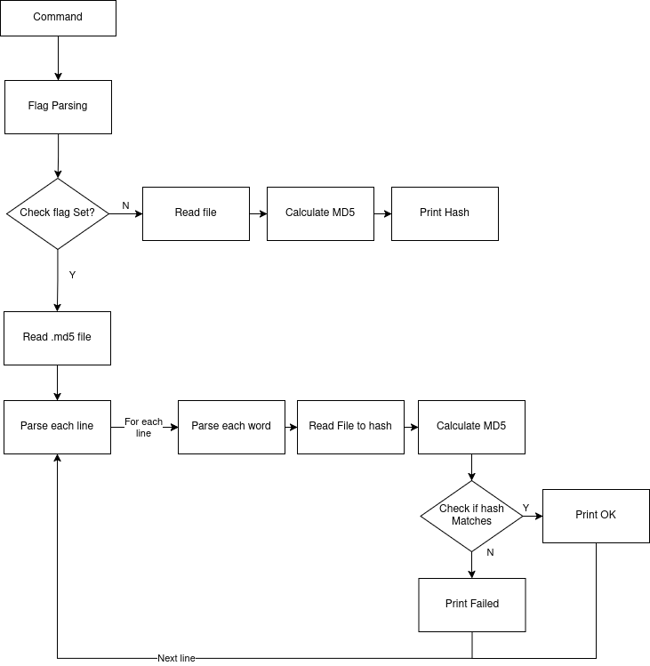
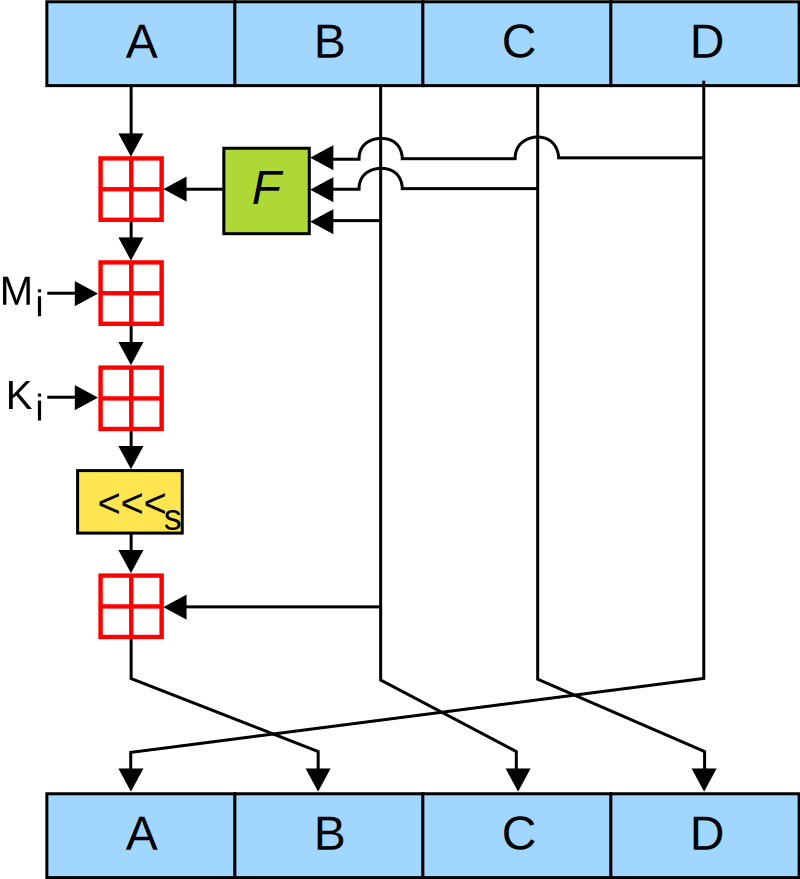

# > [!WARNING]
> Currently the calculated md5sum is wrong. I Could not find the bug in time and
> priotised the rest as the algorithm works when comparing only the hashes it
> has generated itself.


# md5sum
md5sum ([RFC1321](rfc1321.txt)) in Go

## install

To build the project, go into the go folder and there run:
```bash
$ go build .
```

After the build the md5sum executable can be used or maunally installed.

## Usage

The usage is the same as for the common GNU md5sum version with some exceptions.

Currently, the only working flag is ```-c``` as the ```--text``` and
```--binary``` flags are not used on Unix systems.

###Example:

Get MD5 hash from the file ```foo.bar```
```bash
$ md5sum foo.bar
dd32876efbff8edb1a41f81b9b0fc57b  foo.bar
```
Use md5 file to check a list of files

```bash
$ md5sum -c foo.md5
foo.bar: OK
```
    
## Inner workings

### overview of the program flow



### MD5 algorithm overview

As seen from the above image, the md5 algorithm iterates over the message in 512
bit chunks. Each chunk is then processed in a so-called round before beeing used
again with a new chunk.

### MD5 algorithm round calcuation

The Algorithm uses 4 functions which are used on different rounds shown as
```F``` inside the above diagram. After Adding the result of ```F``` onto Block
```A```, the i'th part of the message chunk (```M_i```) as well as the constant
```K_i``` are added to the ```A``` block as well. After the addition the
resulting Block a is shuffeled by a constant each round. Now Block ```B``` is
added onto Block ```A``` and the resulting 4 Blocks are rotated.
*Note: All blocks are 32bit large, and the addition is Mod 2^32*

